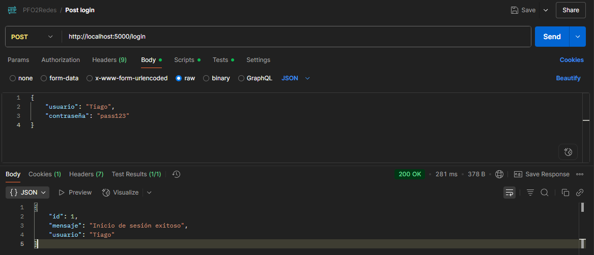
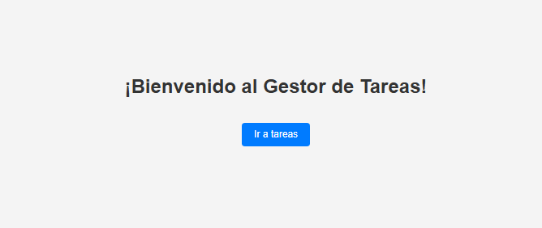
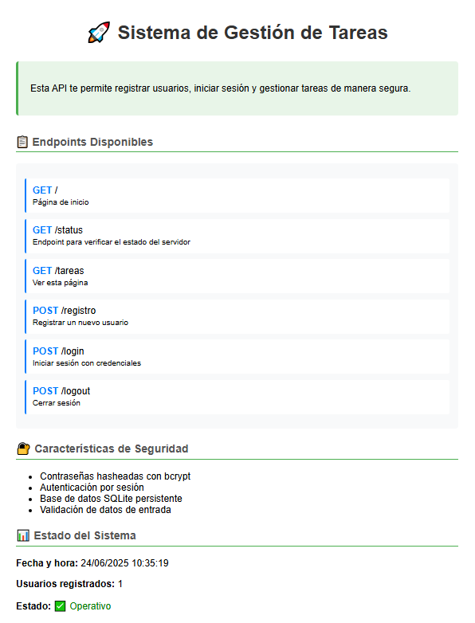
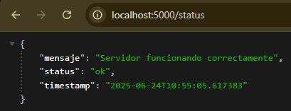
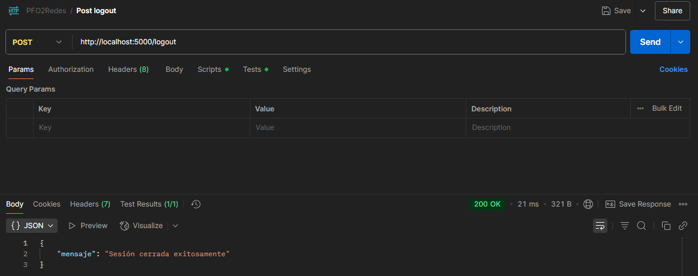

# PFO2: Sistema de Gestión de Tareas con API y Base de Datos

## 📋 Descripción

Sistema de gestión de tareas desarrollado con **Flask** y **SQLite** que implementa autenticación segura con contraseñas hasheadas. El proyecto incluye una API REST con endpoints funcionales para registro de usuarios, inicio de sesión y visualización de una página de bienvenida.

## 🚀 Características

- ✅ API REST con Flask
- ✅ Autenticación segura con contraseñas hasheadas (bcrypt)
- ✅ Base de datos SQLite persistente
- ✅ Validación de datos de entrada básica
- ✅ Página HTML de estilo simple para mostrar información del sistema
- ✅ Cliente de consola para interactuar con la API

#### 📁 **Estructura del Proyecto**

```diff
proyecto-pfo2/
├── servidor.py          # API Flask principal
├── cliente.py           # Cliente de consola para consumir la API
├── requirements.txt     # Dependencias del proyecto
├── README.md            # Documentación
└── database/            # Directorio para la base de datos SQLite
    └── pfo2.db          # Base de datos SQLite (generada automáticamente)
└── capturas/            # Directorio para capturas del sistema
    ├── login.png        # Captura de inicio de sesión exitoso
    ├── bienvenida.png   # Captura de página de bienvenida
    ├── page_sistema.png # Captura de página del sistema
    ├── status.png       # Captura de estado del sistema
    └── logout.png       # Captura de cierre de sesión
    └── registro.png     # Captura de registro exitoso
```

## 🛠️ Instalación y Configuración

### 1. Clona el repositorio

```bash
git clone https://github.com/tiago-appdev/servidor-pfo2.git
cd proyecto-pfo2
```

### 2. Crea un entorno virtual (recomendado)

```bash
python -m venv venv

# En Windows:
venv\Scripts\activate

# En Linux/macOS:
source venv/bin/activate
```

### 3. Instala las dependencias

```bash
pip install -r requirements.txt
```

### 4. Ejecuta el servidor

```bash
python servidor.py
```

El servidor se iniciará en `http://localhost:5000`

---

## 🖥️ Uso del Cliente de Consola

> El archivo `cliente.py` permite consumir los endpoints del servidor desde una interfaz por consola. Podés registrar usuarios, iniciar sesión y visualizar la página del sistema.

### ▶️ Ejecutar

```bash
python cliente.py
```

### 📋 Menú de opciones disponibles

```
--- Cliente de Consola: Gestor de Tareas ---
1. Registrar usuario
2. Iniciar sesión
3. Ver sistema (/tareas)
4. Salir
```

El cliente utiliza la librería `requests` para enviar y recibir datos de la API. Es ideal para probar de forma práctica los endpoints definidos en `servidor.py`.

---

## 📡 Endpoints de la API

### 1. Registro de Usuario

- **URL:** `POST /registro`
- **Content-Type:** `application/json`
- **Cuerpo de la petición:**

```json
{
  "usuario": "user_name",
  "contraseña": "user_pass"
}
```

- **Respuesta exitosa (201):**

```json
{
  "mensaje": "Usuario registrado exitosamente",
  "usuario": "user_name",
  "id": 1
}
```

### 2. Inicio de Sesión

- **URL:** `POST /login`
- **Content-Type:** `application/json`
- **Cuerpo de la petición:**

```json
{
  "usuario": "user_name",
  "contraseña": "user_pass"
}
```

- **Respuesta exitosa (200):**

```json
{
  "mensaje": "Inicio de sesión exitoso",
  "usuario": "user_name",
  "id": 1
}
```

### 3. Página de Sistema

- **URL:** `GET /tareas`
- **Descripción:** Muestra una página HTML con información del sistema

### 4. Endpoints Adicionales

- **URL:** `GET /` - Url raíz que redirige a `/tareas`
- **URL:** `GET /status` - Verificar estado del servidor
- **URL:** `POST /logout` - Cerrar sesión

## 🧪 Cómo Probar la API

### Usando curl:

#### 1. Registrar un usuario:

```bash
curl -X POST http://localhost:5000/registro \
  -H "Content-Type: application/json" \
  -d '{"usuario": "testuser", "contraseña": "1234"}'
```

#### 2. Iniciar sesión:

```bash
curl -X POST http://localhost:5000/login \
  -H "Content-Type: application/json" \
  -d '{"usuario": "testuser", "contraseña": "1234"}'
```

#### 3. Ver página de sistema:

```bash
curl http://localhost:5000/tareas
```

### Usando Python requests:

```python
import requests

# Registrar usuario
response = requests.post('http://localhost:5000/registro',
                        json={'usuario': 'testuser', 'contraseña': '1234'})
print(response.json())

# Iniciar sesión
response = requests.post('http://localhost:5000/login',
                        json={'usuario': 'testuser', 'contraseña': '1234'})
print(response.json())
```

### Usando Postman:

1. **POST** `http://localhost:5000/registro`

   - Headers: `Content-Type: application/json`
   - Body (raw JSON): `{"usuario": "testuser", "contraseña": "1234"}`

2. **POST** `http://localhost:5000/login`

   - Headers: `Content-Type: application/json`
   - Body (raw JSON): `{"usuario": "testuser", "contraseña": "1234"}`

3. **GET** `http://localhost:5000/tareas`

## 🔐 Seguridad Implementada

### Hashing de Contraseñas

- Se utiliza **bcrypt** para hashear contraseñas
- Las contraseñas nunca se almacenan en texto plano
- Salt automático para cada contraseña

### Validaciones

- Verificación de campos requeridos
- Validación de longitud mínima
- Verificación de formato JSON
- Manejo de usuarios duplicados

## 💾 Base de Datos

La aplicación utiliza **SQLite** con las siguientes tablas:

### Tabla `usuarios`

```sql
CREATE TABLE usuarios (
    id INTEGER PRIMARY KEY AUTOINCREMENT,
    usuario TEXT UNIQUE NOT NULL,
    contraseña_hash TEXT NOT NULL,
    fecha_registro TIMESTAMP DEFAULT CURRENT_TIMESTAMP
)
```

### Tabla `tareas` (para futuras implementaciones)

```sql
CREATE TABLE tareas (
    id INTEGER PRIMARY KEY AUTOINCREMENT,
    usuario_id INTEGER,
    titulo TEXT NOT NULL,
    descripcion TEXT,
    completada BOOLEAN DEFAULT 0,
    fecha_creacion TIMESTAMP DEFAULT CURRENT_TIMESTAMP,
    FOREIGN KEY (usuario_id) REFERENCES usuarios (id)
)
```

## 🎯 Capturas de Pruebas Exitosas

### 1. Inicio de Sesión Exitoso



### 2. Página de Bienvenida



### 3. Página de Sistema



### 4. Status de Sistema



### 5. Logout del Sistema



## 🤝 Contribución

1. Fork el proyecto
2. Crea una rama para tu feature (`git checkout -b feature/AmazingFeature`)
3. Commit tus cambios (`git commit -m 'Add some AmazingFeature'`)
4. Push a la rama (`git push origin feature/AmazingFeature`)
5. Abre un Pull Request

## 📄 Licencia

Este proyecto está bajo la Licencia MIT.

## 👨‍💻 Autor

Desarrollado para PFO2 - Sistema de Gestión de Tareas por [Tiago Ibarrola](https://github.com/tiago-appdev)
